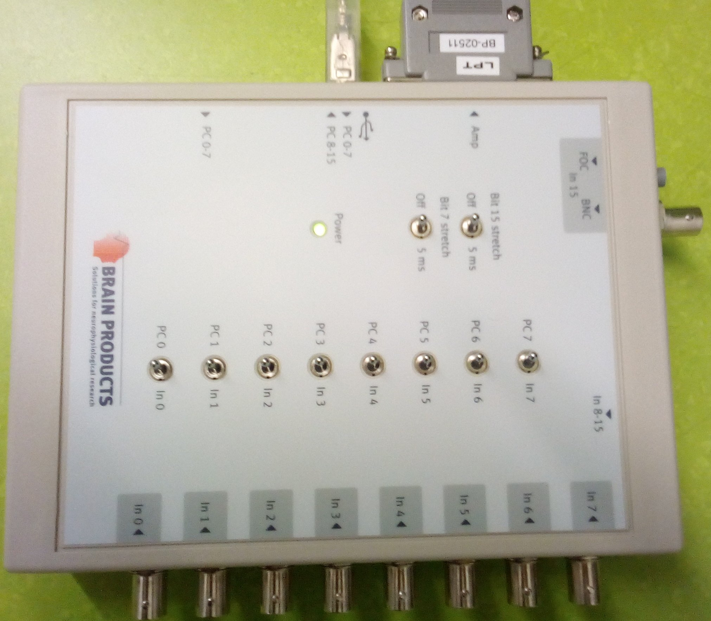
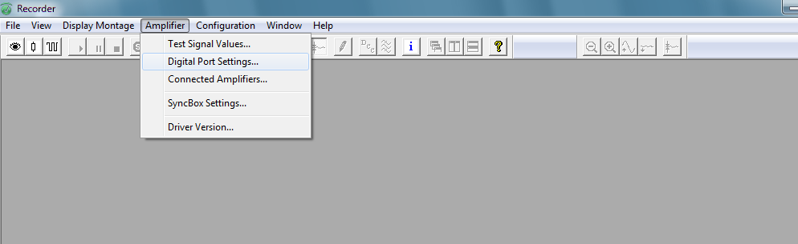
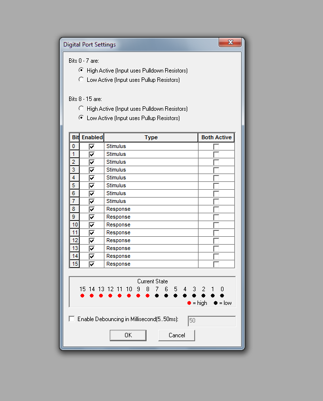

# BrainVision Parallel Port Latency Testing

This Python module is for testing the Brain Products "Trigger Box"

--> https://www.pressrelease.brainproducts.com/triggerbox2/

In particular, we want to check the latency of using a simple parallel port trigger
versus using triggers sent via the Trigger Box.

To check this, we will use a button box that can send triggers upon detecting a
button press (i.e., not passing the computer at all = almost no latency) as the
"ground truth". We will then detect the button presses on the button box with our
computer and immediately send a trigger either via

1. the classical parallel port or
2. the Trigger Box

Then we will calculate the difference between the "ground truth" trigger sent by
the button box and the trigger sent by either method 1. or 2. --- Finally, we will
compare the difference scores based on method 1. and 2.

If these scores are similar, we can safely use the Trigger Box from now on, and will
no longer have to take care to always buy legacy equipment that ships with a parallel port.

# Installation

First, see: http://psychopy.org/installation.html

and install an environment using conda:

```
conda create -n psypy3 python=3.5
conda activate psypy3
conda install numpy scipy matplotlib pandas pyopengl pillow lxml openpyxl xlrd configobj pyyaml gevent greenlet msgpack-python psutil pytables requests[security] cffi seaborn wxpython cython pyzmq pyserial ipython
conda install -c conda-forge pyglet pysoundfile python-bidi moviepy pyosf
pip install zmq json-tricks pyparallel sounddevice pygame pysoundcard psychopy_ext psychopy pytest
```

Finally, run `pip install -e .` from the project root.

## Parallel port setup
... following: http://stefanappelhoff.com/blog/2017/11/23/Triggers-with-Psychopy-on-BrainVision-Recorder

1. Download: https://www.downtowndougbrown.com/2013/06/parallel-port-tester/
2. Download: http://www.highrez.co.uk/downloads/inpout32/default.htm
3. Install 1. and 2. as administrator (follow readmes)
4. Put the inpout32.dll into the same place as parallel-port-tester.exe
5. Find the parallel port address through the parallel-port-tester
6. Put inpoutx64.dll into the directory where the python script for sending trigger is

## TriggerBox setup

1. For the TriggerBox installation, see: https://www.brainproducts.com/downloads.php?kid=40




## BrainVision Recorder setup
1. See: https://www.brainproducts.com/files/public/products/brochures_material/pr_articles/1103_Support_Tip.pdf
2. Specifically, note the "LOW ACTIVE" state for pins 8-15. These are the pins relevant for the button box we are sending trigger signals with. "HIGH ACTIVE" might lead to unexpected results such as the USB trigger (sent via the OS and psychopy) occurring before the TTL trigger (sent only via a copper cable).





# Usage

First, collect data using `collect_data.py` ... save the resulting `.vmrk` files in the `brainvision_pp_latency_testing/data` directory.

To analyze the data, go to `analyze.py` and make sure that `key1` and `key2`
of the `read_vmrk` function are properly set in the `__main__` call. You can
then use the command line to input any file, as for example the test file:

`python analyze_data.py -f ../test/data/test.vmrk`

which will print an output:

```
Analyzing: ../test/data/test.vmrk
Key2 comes after Key1 with a delay of:
------------------------------------
Analyzing differences between 9 sent triggers
Mean 1000.0 samples
STD: 0.0 samples
Median: 1000.0 samples

```

This will also plot a histogram in a new window.

# Tests

Run `pytest --verbose` from the project root.

# Fixes
1. in `psychopy.visual.Window`, use ``winType='pygame'` instead of pyglet
2. on Windows, do `conda uninstall pillow` and then `pip install pillow`, see [here](https://github.com/python-pillow/Pillow/issues/2945)
